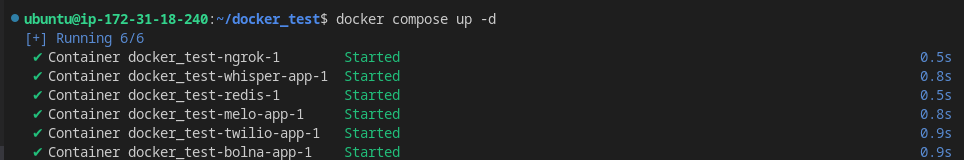
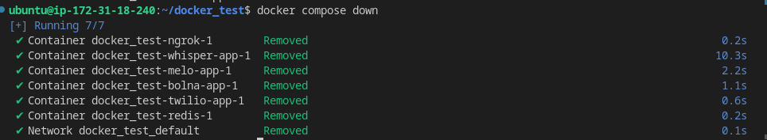

# Bolna With MeloTTS and WhisperASR
Introducing our Dockerized solution! Seamlessly merge Bolna with [Whisper ASR](https://github.com/bolna-ai/streaming-whisper-server) and [Melo TTS](https://github.com/anshjoseph/MiloTTS-Server). This is docker compose by which you can host bolna server Whisper ASR, Melo TTS together in cloud just by clone this repo  and follow these simple steps to deploy ,but before that you have to make sure that you have [docker](https://docs.docker.com/engine/install/) and [docker compose](https://docs.docker.com/compose/install/)

`note: before any thing else make sure you make .env with refer to .env-sample`

### Start Serices
```shell
docker compose up -d
```
the output something like this


note: make sure that your all service were runing

`let assume your server IP is 192.168.1.10`

### Creating Agent
for creating agent you have to execute following command mention below
```shell
curl --location 'http://192.168.1.10:5001/agent' \
--header 'Content-Type: application/json' \
--data '{
  "agent_config": {
    "agent_name": "Alfred",
    "agent_type": "other",
    "tasks": [
      {
        "task_type": "conversation",
        "tools_config": {
          "llm_agent": {
            "model": "gpt-3.5-turbo-16k",
            "max_tokens": 123,
            "agent_flow_type": "streaming",
            "use_fallback": true,
            "family": "openai",
            "temperature": 0.1,
            "request_json": true,
            "provider":"openai"
          },
          "synthesizer": {
            "provider": "melo",
            "provider_config": {
              "voice": "EN_INDIA",
              "sample_rate": 8000,
              "sdp_ratio" : 0.2,
              "noise_scale" : 0.6,
              "noise_scale_w" :  0.8,
              "speed" : 1.0
            },
            "stream": true,
            "buffer_size": 123,
            "audio_format": "pcm"
          },
          "transcriber": {
            "encoding": "linear16",
            "language": "en",
            "model": "whisper",
            "stream": true,
            "task": "transcribe"
          },
          "input": {
            "provider": "twilio",
            "format": "pcm"
          },
          "output": {
            "provider": "twilio",
            "format": "pcm"
          }
        },
        "toolchain": {
          "execution": "parallel",
          "pipelines": [
            [
              "transcriber",
              "llm",
              "synthesizer"
            ]
          ]
        }
      }
    ]
  },
  "agent_prompts": {
    "task_1": {
      "system_prompt": "What is the Ultimate Question of Life, the Universe, and Everything?"
    }
  }
}'

```
below given is the response 

copy the agent_id we have to use in next step

if you want to [Change voice](#change-voice)

### Make call
```shell
curl --location 'http://192.168.1.10:8001/call' \
--header 'Content-Type: application/json' \
--data '{
    "agent_id": "bf2a9e9c-6038-4104-85c4-b71a0d1478c9",
    "recipient_phone_number": "+91XXXXXXXXXX"
}'
```
it gonna give output `Done` for succees

note: if you are using trial account use you register phone no

### Stop Services
```shell
docker compose down
```



### Changing the voice MeloTTS
<a id="change-voice"></a>
by default we resrtict Melo EN but there were 5 option for voice as mention below
- 'EN-US' 
- 'EN-BR' 
- 'EN-AU' 
- 'EN-Default' 
- 'EN_INDIA'

you have to just change the following section mention below
```JSON
"synthesizer": {
            "provider": "melo",
            "provider_config": {
              "voice": "<put your selected voice here>",
              "sample_rate": 8000,
              "sdp_ratio" : 0.2,
              "noise_scale" : 0.6,
              "noise_scale_w" :  0.8,
              "speed" : 1.0
            },
            "stream": true,
            "buffer_size": 123,
            "audio_format": "pcm"
          }
```
and rest of the config gonna be same mention above